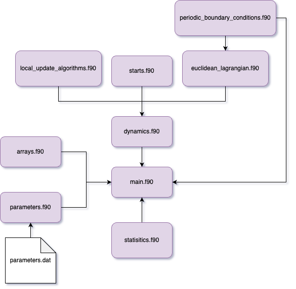

# Quantum Anharmonic Oscillator

This repository implements the numerical solution for the quantum anharmonic oscillator adopting the Markov chain Monte Carlo approach to solve the imaginary time path integral of the system.

The classical Euclidean Lagrangian for this system


$$L_E(x(t_E))= \frac{m}{2}\left(\frac{dx}{d\tau}\right)^2+ \frac{1}{2}m x^2 + \lambda x^4$$ 

we are assumming units in where $\hbar = \omega = 1$ and $\tau$ is the imaginary time. 


`10.1016/j.cpc.2013.02.014 <http://dx.doi.org/10.1016/j.cpc.2013.02.014>`


### Lattice

We assume a lattice with $L$ time increments of $\Delta t$ and each lattice point is given by $x_n= n\Delta t$ for $n= 0,1,2,\dots ,L$. Periodic boundary conditions are imposed on the lattice. The action is given by

$$
S({x_k}) = \sum _{i=1}^{L}\left[\frac{(x_{i+1} - x_i)^2}{\Delta t^2} + \frac{x_i^2}{2} + \lambda x_i^4\right]
$$


<br/>

### Repo Contains
```
.
├── src 
│   ├── arrays.f90 (Module for intitialize arrays) 
│   ├── parameters.f90 (Module for user input parameters) 
│   ├── periodic_boundary_conditions.f90 (Module for implementing the periodic boundary conditions)
│   ├── euclidean_lagrangian.f90 (Module that defines the numerical euclidean lagrangian)  
│   ├── main.f90 (Module that contains the main calls for subroutine and functions)  
│   ├── starts.f90 (Module containing cold and hot start subroutine)  
│   ├── statistics.f90 (Module that implements a variety of useful statistics functions)
│   ├── dynamics.f90 (Module that implements a variety of useful subroutines to the main thermalization algorithm)
│   ├── local_update_algorithms.f90 (Module that contains the Metropolis and Glauber algorithms)
├── data (folder to store the output data)
├── figures (folder to store output animation)


  
```

# Usage and Compilation

-----------

The main code is standard Fortran 90 and can be compiled
with any standard f90 conforming compiler.

## Intitial Conditions
You can modifiy the ``parameters.dat`` file to enter different settings for the input parameters. The defult ones are: 

```
&input_parameters
N_thermalization = 1000,
N_measurements = 1000,
N_skip = 10,
L = 100,
dt = 0.1,
epsilon = 1.0,
lambda = 0.0,
start = "hot"
/
```

To run the program execute the following line in the terminal:
```
./compile.sh
```

Structure Of The Program
------------------------

The structure of the Fortran 90 modules is described here. The relations of all .f90 files are can be summarized as follows:


